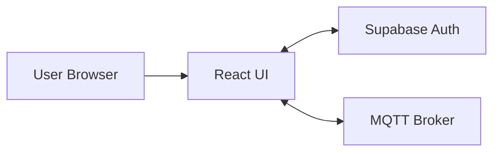

# PortoUcup Technical Script

## 1. Project Overview
Narasi:
Website ini adalah Single Page Application yang berfungsi sebagai portofolio profesional, dengan tambahan dashboard monitoring perangkat berbasis data real time. Tujuan utamanya adalah menampilkan identitas, pengalaman, dan karya secara visual, sekaligus memberi akses monitoring hanya untuk pengguna terautentikasi.

Masalah yang diselesaikan:
- Menyediakan portofolio interaktif yang mudah dinavigasi.
- Mengamankan halaman monitoring dari akses publik.
- Menampilkan data sensor IoT secara real time dan terstruktur.

Alur singkat:
1. Pengguna membuka landing page dan menelusuri section About, Experience, Works, Testimoni, dan Kontak.
2. Pengguna login lewat modal agar bisa mengakses menu Monitoring.
3. Monitoring mengkonsumsi data sensor lewat MQTT dan menampilkannya dalam card indikator dan grafik.

## 2. Tech Stack dan Infrastruktur
Narasi:
Stack yang digunakan murni client-side, sehingga tidak ada server custom di proyek ini. Untuk autentikasi dan data real time, aplikasi mengandalkan layanan eksternal.

### 2.1 Bahasa Pemrograman
- TypeScript untuk UI dan logika aplikasi.

### 2.2 Front-end
- React untuk komponen UI dan state management.
- React Router untuk routing SPA.
- Vite sebagai bundler dan dev server.
- Tailwind CSS v4 untuk utilitas styling.
- Emotion untuk styling di komponen tertentu seperti loader.
- Motion untuk animasi UI.
- Recharts untuk chart data monitoring.

### 2.3 Back-end
- Tidak ada server custom.
- Supabase digunakan hanya untuk autentikasi.

### 2.4 Database
- Supabase Auth menggunakan Postgres di belakang layar.
- Skema database tidak didefinisikan di repo, karena hanya memakai auth.

### 2.5 Teknologi Tambahan
- MQTT over WebSocket untuk streaming data sensor.
- Assets media (video hero, gambar profil) untuk pengalaman visual.

Ringkasan stack (tabel):

| Layer | Teknologi | Peran |
| --- | --- | --- |
| UI | React, Motion, Tailwind | Rendering UI, animasi, styling |
| Routing | React Router | SPA navigation |
| Auth | Supabase | Login, signup, session |
| Realtime | MQTT (EMQX) | Data sensor streaming |
| Charts | Recharts | Visualisasi tren data |

## 3. Arsitektur Sistem
Narasi:
Arsitektur aplikasi bersifat client-centric. Semua rendering dan interaksi terjadi di browser. Hanya autentikasi dan data sensor yang keluar menuju layanan eksternal.

Mermaid diagram:



Penjelasan alur:
- UI memuat halaman portofolio secara lokal melalui SPA.
- Ketika login, UI memanggil Supabase Auth untuk validasi kredensial.
- Ketika halaman Monitoring dibuka, UI terkoneksi ke MQTT broker dan berlangganan topik sensor.

## 4. Struktur Direktori dan Peran File
Narasi:
Struktur proyek memisahkan entry, routing, komponen, dan halaman untuk menjaga modularitas.

```
PortoUcup/
  src/
    main.tsx
    styles/
      index.css
      tailwind.css
      theme.css
    lib/
      supabase.ts
    app/
      App.tsx
      routes.tsx
      assets/
      components/
        AuthModal.tsx
        Layout.tsx
        Loader.tsx
        NavPanel.tsx
        ParticleField.tsx
        ProtectedRoute.tsx
        constants.ts
        figma/
          ImageWithFallback.tsx
        ui/
      pages/
        Home.tsx
        Tentang.tsx
        Pengalaman.tsx
        Karya.tsx
        Testimoni.tsx
        Kontak.tsx
        Monitoring.tsx
```

Keterangan bagian penting:
- main.tsx: entry point, mount React.
- App.tsx: loader awal dan render RouterProvider.
- routes.tsx: definisi semua route dan proteksi Monitoring.
- components/Layout.tsx: layout global, nav panel, dan container konten.
- components/NavPanel.tsx: navigasi dengan logika session.
- components/ProtectedRoute.tsx: guard akses route.
- components/AuthModal.tsx: login dan signup.
- lib/supabase.ts: inisialisasi Supabase client.
- pages/Monitoring.tsx: logika MQTT, chart, indikator.

Catatan tambahan:
- Ada file Auth.tsx yang menyediakan halaman auth standalone, namun saat ini navigasi utama menggunakan AuthModal. File ini bisa dianggap opsi cadangan atau legacy.

## 5. Fitur Inti dan Logika Utama

### 5.1 Autentikasi dan Proteksi Route
Narasi:
Login dilakukan lewat modal. Session disimpan di state. Menu Monitoring hanya muncul jika session aktif. Ketika user langsung mengakses /monitoring, ProtectedRoute akan mengecek session dan mengarahkan ke home jika tidak login.

Alur detail:
1. User klik login di nav panel.
2. AuthModal memanggil Supabase Auth.
3. Session tersimpan, nav panel menambah menu Monitoring.
4. ProtectedRoute memvalidasi session sebelum menampilkan Monitoring.

Nilai tambah:
- Keamanan dasar untuk halaman monitoring.
- Pengalaman user lebih mulus tanpa redirect manual.

### 5.2 Monitoring Real Time via MQTT
Narasi:
Monitoring membangun koneksi WebSocket ke broker. Data sensor dalam format JSON ditampilkan pada kartu indikator dan chart. Ada mode simulasi untuk pengujian tanpa hardware.

Alur detail:
1. MQTT client terkoneksi ke broker.
2. Subscribe topik sensor.
3. Payload JSON diparsing menjadi state.
4. UI memperbarui indikator suhu, kelembapan, CPU, tegangan.
5. Chart diupdate dengan data baru pada interval real time.

Nilai tambah:
- Monitoring langsung tanpa refresh.
- Bisa dipakai untuk demonstrasi dengan simulator.

### 5.3 Portofolio Interaktif dan Filter
Narasi:
Halaman Karya memiliki kategori filter. User dapat memilih kategori, dan list card akan berubah tanpa reload. Setiap card memiliki hover effect yang menonjolkan detail singkat.

Alur detail:
1. User pilih filter kategori.
2. State filter mengubah array project.
3. Grid otomatis re-render dengan animasi transisi.

Nilai tambah:
- Navigasi karya lebih cepat.
- Visual lebih engaging untuk presentasi portofolio.

### 5.4 Testimoni dan Statistik
Narasi:
Halaman Testimoni menampilkan highlight testimonial yang berganti secara otomatis, lengkap dengan statistik ringkas. Efek animasi menjaga halaman tetap hidup.

Alur detail:
1. Interval mengganti testimoni utama setiap 5 detik.
2. User bisa memilih manual lewat dot navigation.
3. Statistik tetap tampil untuk membangun kredibilitas.

## 6. UI dan Pengalaman Visual
Narasi:
Desain mengandalkan kombinasi warna midnight, lime, dan hijau. Efek glow, particle field, dan animasi transisi membuat tampilan terasa premium dan hidup.

Elemen visual utama:
- Loader animasi SVG di awal.
- Particle background dan orb glow.
- Sidebar nav yang bisa collapse.
- Hero section dengan background video.

## 7. Konfigurasi dan Environment
Narasi:
Aplikasi butuh konfigurasi env untuk Supabase.

Env variables:
- VITE_SUPABASE_URL
- VITE_SUPABASE_ANON_KEY

Catatan keamanan:
- Kredensial MQTT saat ini berada di client. Ini memudahkan demo, namun sebaiknya dipindah ke backend proxy jika nanti production.

## 8. Cara Menjalankan
Narasi:
Proyek dijalankan dengan Vite.

Command:
```bash
npm install
npm run dev
```

## 9. Batasan dan Rencana Pengembangan
Narasi:
Beberapa hal yang bisa ditingkatkan untuk versi berikutnya:
- Menambahkan backend proxy untuk MQTT agar kredensial tidak terbuka.
- Menambah logging dan error reporting.
- Menyimpan data sensor historis ke database agar bisa analisis jangka panjang.
- Mengembangkan role management di Supabase untuk kontrol akses lebih detail.

## 10. Penutup
Narasi:
PortoUcup menggabungkan personal branding dan demonstrasi kemampuan teknis. Portfolio tampil interaktif dan modern, sementara monitoring real time menunjukkan pengalaman di IoT dan HMI. Ini membuat proyek cocok dipresentasikan sebagai showcase profesional dan bukti kemampuan full-stack berbasis front-end dan realtime data.
